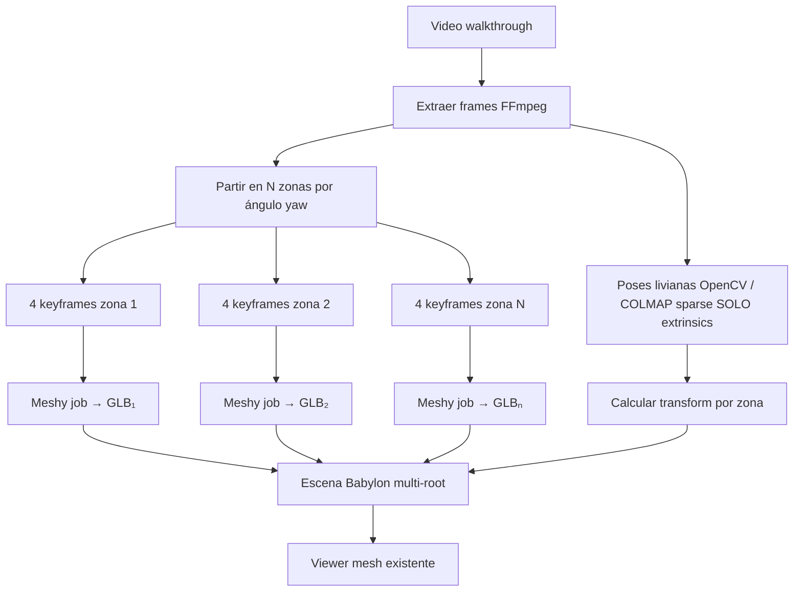

# Spike: habitación con Meshy (solo mesh, sin point cloud)

**Objetivo:** maximizar fidelidad espacial usando **únicamente meshes (GLB)** — sin PLY, sin Gaussian splats, sin nube de puntos como artefacto intermedio visible.

**Alcance del spike:** 3–5 días de I+D + 1 día de evaluación con 3 videos reales.

**No incluye:** LongSplat, MakeSplat, splat3D, COLMAP dense point cloud como deliverable.

---

## Por qué este enfoque

Meshy Multi-Image-to-3D asume **1 objeto, 1–4 vistas**. Una habitación entera viola ese contrato. Sin point cloud, la única salida viable es **componer varios meshes** en una escena con **poses de cámara del video** como ancla geométrica (SfM liviano → matrices 4×4, no nube).

---

## Estrategia recomendada: **Zone Mesh Composition (ZMC)**

Partir el recorrido del video en **zonas angulares**, reconstruir cada zona con Meshy, y **ensamblar** los GLB en el viewer con transforms derivados de las poses del video.



### Parámetros iniciales del spike

| Parámetro | Valor spike | Notas |
|-----------|-------------|-------|
| N zonas | 4 (90° cada una) | Ajustar a 6 si habitación > 20 m² |
| Keyframes por zona | 4 (máx Meshy) | Reutilizar `keyframe_selector` con filtro por zona |
| Poses | COLMAP sparse **o** OpenCV essential matrix + scale heurístico | Solo matrices; descartar points3D del export |
| Merge | Multi-root en Babylon | Sin boolean union; cada GLB es nodo hijo |
| Shell opcional | Prisma room box | Paredes/suelo/techo low-poly texturizados con frames panorámicos |

---

## Fases del spike

### Fase 0 — Baseline (medio día)

Medir lo que ya tenemos hoy:

1. Job actual: 1 video → 4 keyframes globales → 1 Meshy → 1 GLB.
2. Métricas: tiempo total, créditos Meshy, tamaño GLB, subjetivo 1–5 “¿parece la habitación?”.

**Criterio:** baseline documentado antes de tocar código.

---

### Fase 1 — Segmentación por zonas (1 día)

**Input:** frames + timestamps + (opcional) poses aproximadas del movimiento de cámara.

**Algoritmo:**

1. Estimar **dirección de mirada** por frame (optical flow dominante o bearing desde posición relativa si hay poses).
2. Asignar cada frame a bucket `zone_id = floor(yaw / (360/N))`.
3. Por zona, ejecutar selector de keyframes existente con restricciones:
   - Máx 4 imágenes
   - Diversidad angular dentro de la zona (front, left-ish, right-ish, detail)
   - Penalizar frames con motion blur (Laplacian variance)

**Entregable:** `select_zone_keyframes(frames, n_zones=4) -> dict[zone_id, list[Path]]`

**Archivos a extender:**

- `backend/services/meshy/keyframe_selector.py` — añadir modo `by_zone`
- `backend/core/pipeline.py` — loop N zonas → N jobs Meshy

**Tests:** extender `backend/tests/test_keyframe_selector.py` con video sintético (4 paredes simuladas).

---

### Fase 2 — Poses sin point cloud (1–1.5 días)

Necesitamos **transforms relativos** entre zonas, no una nube densa.

**Opción A (preferida spike): COLMAP sparse, solo extrinsics**

```bash
# Pipeline mínimo — output: cameras.txt / images.txt
# NO exportar points3D.ply al viewer; usar solo quaternions + translation
colmap feature_extractor ...
colmap exhaustive_matcher ...
colmap mapper ...
```

- Por cada zona, tomar el **centroide de poses** de sus keyframes → origen local del GLB Meshy.
- Transform zona → mundo: matriz 4×4 de la cámara “representativa” de esa zona.

**Opción B (fallback sin COLMAP): bearing + distancia heurística**

- Asumir cámara a ~1.5 m del suelo, movimiento circular lento.
- `yaw` desde integración de gyro visual (optical flow) o timestamps uniformes en círculo.
- Escala: `auto_size` de Meshy por objeto + usuario confirma una dimensión conocida (ej. puerta 2 m).

**Entregable:** `backend/services/meshy/scene_compose.py`

```python
@dataclass
class ZoneMesh:
    zone_id: int
    glb_path: Path
    transform: list[list[float]]  # 4x4 row-major

def compose_zone_transforms(poses_by_zone: dict[int, CameraPose]) -> dict[int, Matrix4]: ...
```

**Restricción explícita:** `points3D` de COLMAP se usa solo en memoria para scale; **no se persiste PLY**.

---

### Fase 3 — Pipeline multi-job Meshy (1 día)

Cambiar pipeline de 1 job a N jobs paralelos (respetar rate limit Meshy: 10–30 queued).

```
for zone_id, keyframes in zones.items():
    urls = upload(keyframes)
    task_id = meshy.create_multi_image_task(urls, ai_model="meshy-7", ...)
    glb = meshy.poll_and_download(task_id)
    zones[zone_id].glb = glb
```

**Metadata del job** (JSON sidecar, no DB migration obligatoria en spike):

```json
{
  "composition_mode": "zone_mesh",
  "zones": [
    { "id": 0, "mesh_url": "...", "transform": [[...], ...] },
    { "id": 1, "mesh_url": "...", "transform": [[...], ...] }
  ]
}
```

**API:** `GET /api/jobs/{id}/model` devuelve GLB único **o** manifest JSON + múltiples GLB (spike: manifest + endpoints `/model/zone/{id}`).

---

### Fase 4 — Viewer multi-mesh (1 día)

Extender carga mesh existente:

1. Si job tiene `composition_mode=zone_mesh`, fetch manifest.
2. Por cada zona: `ImportMeshAsync` con transform pre-aplicado.
3. Parent node `room_root` para framing de cámara (`viewer_initial_camera.py` usa bounding box agregado).

**Archivos:**

- `frontend/src/viewer/load/loadMeshScene.ts` — `importGlbBuffer` + `importComposedScene(manifest)`
- `frontend/src/viewer/hooks/useMeshViewer.ts` — detectar manifest
- `backend/services/viewer_initial_camera.py` — bbox de todos los roots

**Walkthrough:** reutilizar `useWalkthroughMode.ts` con path = poses originales del video (ya existente en repo).

---

### Fase 5 — Room shell opcional (medio día, si Fase 1–4 insuficiente)

Si los meshes de zona dejan “huecos” en paredes:

1. Estimar dimensiones aproximadas (bbox agregado de meshes + margen).
2. Generar **prisma habitación** (6 quads) en backend (`trimesh` o script glTF).
3. Textura cada pared: **panorama 2D** = mosaico del frame más frontal de esa pared (sin point cloud).
4. Insertar como mesh estático bajo `room_shell` en la escena.

**Coste Meshy:** 0 créditos extra. Mejora percepción de “estar dentro” sin splats.

---

## Alternativa B (más fidelidad, más coste): **Object-first composition**

Si ZMC no basta para muebles:

1. Detectar objetos en frames (SAM 2 / YOLO — spike usa bbox simple).
2. Por objeto: crop 4 vistas → Meshy job.
3. Posicionar cada GLB en la escena con pose 2D→3D aproximada (raycast al shell o plano suelo y=0).

| | ZMC (A) | Object-first (B) |
|--|---------|------------------|
| Paredes | Medias (zonas) | Shell prisma |
| Muebles | Dentro del blob de zona | Buenos |
| Jobs Meshy | 4–6 | 10–20+ |
| Complejidad | Media | Alta |

**Recomendación spike:** implementar **A primero**; B solo si A falla criterios.

---

## Criterios de éxito / kill

| Métrica | Pass | Kill (abandonar workaround) |
|---------|------|----------------------------|
| Cobertura visual | ≥ 70% del perímetro de la habitación reconocible | < 40% |
| Seams entre zonas | Aceptables a > 2 m distancia | Grietas > 30 cm visibles en walkthrough |
| Tiempo pipeline | < 15 min (4 zonas paralelo) | > 30 min |
| Coste Meshy | ≤ 120 créditos / scan (6 zonas) | > 200 sin mejora vs baseline |
| Walkthrough | Usuario completa circuito sin mareo | Cámara incoherente |

Si **kill:** migrar a splat (LongSplat / API) — fuera de este spike.

---

## Riesgos conocidos

1. **Escala inconsistente entre zonas** — Meshy `auto_size` por job independiente. Mitigación: fijar `origin_at` + una referencia de escala global (medida manual o puerta estándar 2.0 m).
2. **Overlap duplicado** — misma mesa en 2 zonas → doble mesh. Mitigación spike: ignorar; fase 2 usar IoU 2D para deduplicar objetos.
3. **Rate limit Meshy** — encolar con backoff; max 4 jobs paralelos.
4. **GLB pesado** — 4×65 MB = lento en móvil. Mitigación: `target_polycount` más bajo en zonas, Draco en export.

---

## Plan de implementación mínimo (orden)

| Día | Tarea | Output |
|-----|-------|--------|
| 1 | `select_zone_keyframes` + tests | Unit tests green |
| 2 | COLMAP sparse wrapper (solo extrinsics) | `scene_compose.py` |
| 3 | Pipeline multi-job + manifest JSON | Job devuelve 4 GLB |
| 4 | Viewer multi-root + framing | ScanView carga escena compuesta |
| 5 | 3 videos reales + scorecard | Go / no-go doc |

---

## Qué NO hacer en este spike

- Exportar o mostrar `.ply` / point cloud
- Gaussian splats
- Boolean merge de meshes (artefactos)
- Más de 4 imágenes por llamada Meshy (API cap)
- Prometer métricas de medición milimétricas (Meshy no es survey-grade)

---

## Decisión esperada post-spike

| Resultado | Siguiente paso |
|-----------|----------------|
| **Go** | Productizar modo “Habitación (beta)” con disclaimer + límite 4–6 zonas |
| **Conditional go** | ZMC + room shell prisma; posponer object-first |
| **No-go** | Priorizar integración splat; Meshy queda solo en modo Objeto |

---

## Referencias internas

- Pipeline actual: `backend/core/pipeline.py`
- Keyframes: `backend/services/meshy/keyframe_selector.py`
- Viewer mesh: `frontend/src/viewer/load/loadMeshScene.ts`
- Walkthrough: `frontend/src/viewer/hooks/useWalkthroughMode.ts`
- Decisión previa Meshy vs Hi3D: `docs/spike/meshy-vs-hi3d-decision.md`
