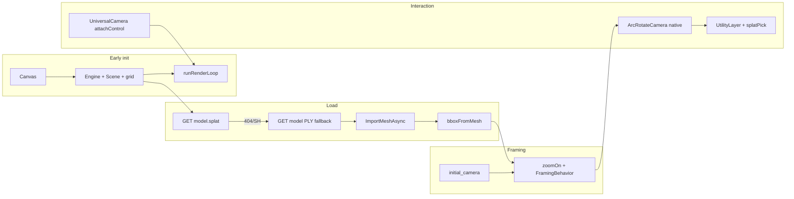

# Viewer 3D — Babylon.js refactor audit (2026)

Primary code: [`frontend/src/viewer/`](../frontend/src/viewer/) (modular viewer), [`frontend/src/lib/splatPick.ts`](../frontend/src/lib/splatPick.ts), [`backend/services/export/to_splat.py`](../backend/services/export/to_splat.py).

## Architecture

## Module layout

| Path | Role |
|------|------|
| `viewer/hooks/useBabylonViewer.ts` | Early Engine, fetch progress, load |
| `viewer/hooks/useSplatDisplay.ts` | `minPixelSize` + SH (no `updateData`) |
| `viewer/hooks/useCameraMode.ts` | Orbit/walk/measure detach, auto-rotate |
| `viewer/hooks/useMeasureMode.ts` | Pick + UtilityLayer overlays |
| `viewer/camera/framing.ts` | `zoomOn`, `FramingBehavior`, bbox post-load |
| `viewer/overlays/sceneOverlays.ts` | `GridMaterial` + axes |
| `viewer/dev/inspector.ts` | `?inspector=1` → `ShowInspector` |
| `viewer/xr/webXRExperience.ts` | Optional Enter VR |

## Capabilities checklist

| Feature | Implementation | QA |
|---------|----------------|-----|
| Early canvas | Engine before model fetch | Grid visible during load |
| Load progress | Fetch % + phase labels | Bar during download |
| Prefer `.splat` | `GET /api/jobs/{id}/model.splat` | Faster than PLY when no SH |
| Orbit | `zoomOn`, beta limits, `panningAxis`, `zoomToMouseLocation` | No flip under floor |
| Reset | `initialPoseRef` + `FramingBehavior` | Toolbar Reset |
| Walkthrough | `UniversalCamera.attachControl` (single loop) | WASD + mouse |
| Measure | UtilityLayer gizmos + front-most pick | `?pickDebug=1` |
| Display | `minPixelSize` GPU cull (not buffer rebuild) | Slider smooth on 500k+ |
| Inspector | `?inspector=1` lazy load | Dev/staging only |
| WebXR | Enter VR toolbar when supported | Optional |

## Picking constants (`splatPick.ts`)

Unchanged: `PICK_RADIUS_PX=22`, `PICK_CENTER_ALPHA_FLOOR=55`, front-most rule.

## Manual QA (post-deploy)

1. Canvas shows grid within ~500 ms; fetch progress during download.
2. Completed scan loads (`.splat` if exported, else PLY).
3. Orbit/pan/zoom/Reset; walkthrough WASD without pointer-lock bugs.
4. Measure: yellow preview, blue placed points, no orbit steal in measure mode.
5. Display slider: no multi-second freeze on large models.
6. `?inspector=1` opens Inspector v2 after load.
7. `curl …/health` healthy; job status polls via Vercel rewrites.

## Backend `.splat`

Pipeline step after PLY export: [`to_splat.py`](../backend/services/export/to_splat.py) writes `{job_id}.splat` (32 B/splat, Babylon-native). Endpoint: `GET /api/jobs/{id}/model.splat`.

## Removed patterns (2026 refactor)

- Monolithic 2000-line `Viewer3D.tsx` (split into `frontend/src/viewer/*`)
- Hand-rolled walkthrough RAF + pointer lock
- `filterSplatsByMinAlpha` + `updateData` on every slider move
- Main-scene measure overlays (`renderingGroupId=2`, `disableDepthWrite`)
- Client `parsePLYForMeta` when server metadata present (fallback only)
